# BEP 52 (BitTorrent v2) Low-Level Design for rqbit

**Status:** DRAFT
**Target:** rqbit v9.x / librqbit-core v6
**Spec:** [BEP 52](https://www.bittorrent.org/beps/bep_0052.html)
**Companion:** [BEP52-RQBIT-CONTRIBUTION-PLAN.md](../../DistributedContentPreservationProtocol/dcpp-rust/docs/BEP52-RQBIT-CONTRIBUTION-PLAN.md)

---

## Table of Contents

1. [Executive Summary](#1-executive-summary)
2. [Existing Architecture Analysis](#2-existing-architecture-analysis)
3. [Crate Dependency Hierarchy](#3-crate-dependency-hierarchy)
4. [Design Principles](#4-design-principles)
5. [Phase 1: Core Types & Parsing](#5-phase-1-core-types--parsing)
6. [Phase 2: Merkle Tree Verification](#6-phase-2-merkle-tree-verification)
7. [Phase 3: Peer Protocol Upgrade](#7-phase-3-peer-protocol-upgrade)
8. [Phase 4: Torrent Creation](#8-phase-4-torrent-creation)
9. [Cross-Cutting Concerns](#9-cross-cutting-concerns)
10. [Test Strategy](#10-test-strategy)
11. [Migration & Compatibility](#11-migration--compatibility)
12. [Risk Register](#12-risk-register)

---

## 1. Executive Summary

This document specifies the low-level design for adding BEP 52 (BitTorrent v2) support to rqbit. The design follows the **dual-option struct** pattern established by the maintainer in PR #72, the **parallel hashing pipeline** architecture from libtorrent, and rqbit's existing patterns of generic `BufType` parameters, trait-based hash abstraction, and zero-copy bencode deserialization.

### Key Design Decisions (from closed questions)

| Decision | Answer |
|----------|--------|
| v2-only-first or hybrid-first? | v2-only-first, then complete hybrid |
| Feature flag? | Always-on, optional off parameter |
| Merkle crate split? | In `librqbit-core` initially |
| Breaking changes? | Dual-option structs, not enums (PR #72 pattern) |
| Performance target? | SHA-256 >= 600 MB/s (disk-bound, not CPU-bound) |
| First PR scope? | Phases 1 + 2 (parsing + verification) |

---

## 2. Existing Architecture Analysis

### 2.1 Identified Patterns

The following patterns are already established in the codebase and **must be preserved**:

#### Pattern 1: Generic `BufType` for Zero-Copy Parsing

Every metadata struct is parameterized over `BufType`, enabling both borrowed (`ByteBuf<'a>`) and owned (`ByteBufOwned`) variants from a single definition.

```
torrent_metainfo.rs:47   TorrentMetaV1<BufType>
torrent_metainfo.rs:85   TorrentMetaV1Info<BufType>
torrent_metainfo.rs:430  TorrentMetaV1File<BufType>
```

**Implication:** All new v2 structs must also be generic over `BufType` and implement `CloneToOwned`.

#### Pattern 2: `WithRawBytes` for Info Hash Computation

The `info` field in `TorrentMetaV1` is wrapped in `WithRawBytes<T, Buf>`, which captures the raw bencode bytes alongside the deserialized struct. The info hash is computed from these raw bytes, not from re-serialization.

```
bencode/deserialize.rs:548  pub struct WithRawBytes<T, Buf> { pub data: T, pub raw_bytes: Buf }
torrent_metainfo.rs:56      pub info: WithRawBytes<TorrentMetaV1Info<BufType>, BufType>,
torrent_metainfo.rs:36      digest.update(t.info.raw_bytes.as_ref());  // SHA-1 of raw info bytes
```

**Implication:** v2 info hash (SHA-256) must also be computed from the same raw `info` bytes. We compute both digests from the same byte range.

#### Pattern 3: Const-Generic `Id<N>` Hash Type

PR #72 introduced `Id<const N: usize>` with type aliases, avoiding duplication:

```
hash_id.rs:6     pub struct Id<const N: usize>(pub [u8; N]);
hash_id.rs:170   pub type Id20 = Id<20>;
hash_id.rs:172   pub type Id32 = Id<32>;
```

**Implication:** No new hash container types needed. Use `Id32` everywhere v2 hashes appear.

#### Pattern 4: Dual-Option Structs Over Enums

The maintainer explicitly rejected an `InfoHash` enum in favor of dual options on `Magnet`:

```
magnet.rs:8-9    id20: Option<Id20>, id32: Option<Id32>
```

**Implication:** Add `info_hash_v2: Option<Id32>` alongside `info_hash: Id20` on torrent structs rather than replacing with an enum.

#### Pattern 5: Trait-Based Hash Abstraction (`ISha1`)

```
sha1w/lib.rs:8-12
    pub trait ISha1 {
        fn new() -> Self;
        fn update(&mut self, buf: &[u8]);
        fn finish(self) -> [u8; 20];
    }
```

Two backends: `crypto-hash` (default, uses OpenSSL) and `ring` (uses aws-lc-rs). Feature flags select one at compile time via `assert_cfg::exactly_one!`.

**Implication:** Add `ISha256` trait following the same pattern, using the same backend libraries.

#### Pattern 6: `Lengths` as Central Piece Geometry Calculator

```
lengths.rs:36-49
    pub struct Lengths {
        total_length: u64,
        piece_length: u32,
        last_piece_id: u32,
        last_piece_length: u32,
        chunks_per_piece: u32,
    }
```

This struct computes piece offsets, chunk boundaries, and bitfield sizes. It is constructed from `TorrentMetaV1Info`.

**Implication:** v2 piece geometry differs (file-aligned pieces). Need a parallel `V2Lengths` or extend `Lengths` to handle per-file piece calculations.

#### Pattern 7: `FileOps` for Hash Verification

```
file_ops.rs:51-56
    pub(crate) struct FileOps<'a> {
        torrent: &'a ValidatedTorrentMetaV1Info<ByteBufOwned>,
        files: &'a dyn TorrentStorage,
        file_infos: &'a FileInfos,
    }
```

`initial_check()` and `check_piece()` iterate files, read data, and compute SHA-1 hashes. Both must be extended for v2 merkle verification.

### 2.2 Current Torrent Lifecycle

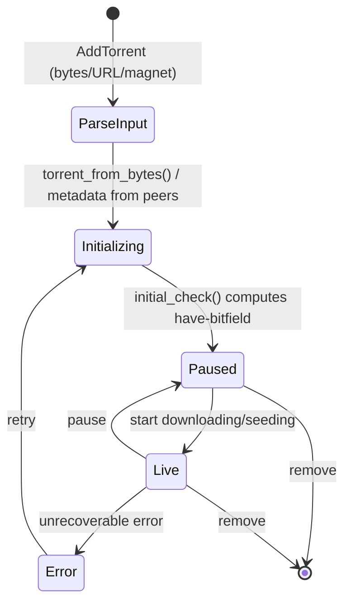

### 2.3 Current Data Flow: Piece Download & Verification

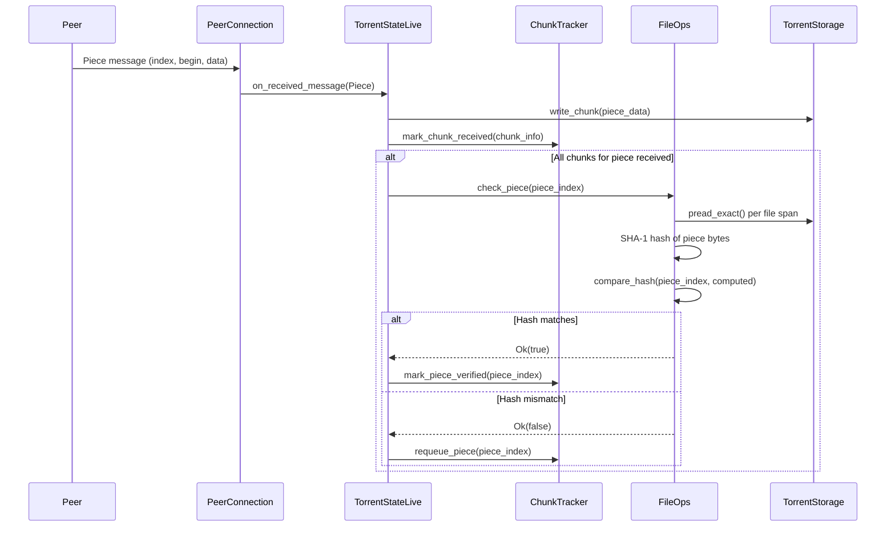

---

## 3. Crate Dependency Hierarchy

### 3.1 Current Hierarchy

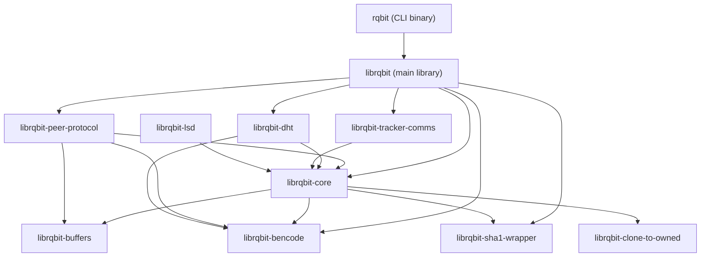

### 3.2 Changes for BEP 52

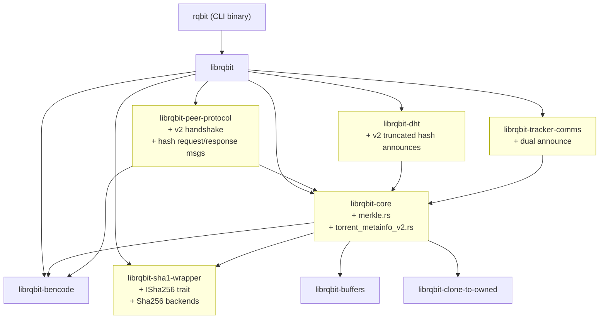

**Legend:** Yellow = modified crates.

No new crates are introduced. Merkle tree logic lives in `librqbit-core/src/merkle.rs`.

---

## 4. Design Principles

These principles derive from libtorrent's architecture, the BEP 52 spec, and rqbit's established patterns:

1. **Dual-option, not enum.** Add `Option<V2Field>` alongside existing v1 fields. Never replace v1 fields.

2. **Parallel pipelines, not branching.** v1 and v2 hashing pipelines run independently over the same file data. They never derive from each other.

3. **One torrent, multiple hash domains.** The underlying content is identical. v1 and v2 provide parallel cryptographic identities.

4. **File-aligned piece boundaries for v2.** v1 pieces span files (concatenated). v2 pieces are per-file and aligned to piece boundaries.

5. **Incremental adoption via accessors.** Existing code that calls `.info_hash` or `.as_id20()` continues to work. New code opts in to `.info_hash_v2` / `.as_id32()`.

6. **Trait-based hash abstraction.** `ISha256` mirrors `ISha1`. Both use the same backend selection mechanism.

7. **Zero-copy where possible.** v2 metadata structs use the same `BufType` generic pattern for borrowed/owned variants.

---

## 5. Phase 1: Core Types & Parsing

### 5.1 SHA-256 Hash Wrapper

**File:** `crates/sha1w/src/lib.rs`

Add `ISha256` trait alongside `ISha1`, using the same backend crates:

```rust
pub trait ISha256 {
    fn new() -> Self;
    fn update(&mut self, buf: &[u8]);
    fn finish(self) -> [u8; 32];
}
```

**Backend implementations:**

| Feature flag | Backend | SHA-256 source |
|---|---|---|
| `sha1-crypto-hash` | OpenSSL via crypto-hash | `crypto_hash::Algorithm::SHA256` |
| `sha1-ring` | aws-lc-rs | `aws_lc_rs::digest::SHA256` |

The feature flag names stay as `sha1-*` for backward compatibility; they now gate both SHA-1 and SHA-256 backends.

### 5.2 Torrent Metainfo: v2 Structures

**File:** `crates/librqbit_core/src/torrent_metainfo.rs` (extend existing)

#### 5.2.1 v2 File Tree Node

BEP 52 defines a recursive nested dictionary for the file tree. In the bencode representation:
- Directory nodes are dictionaries mapping path component keys to child nodes.
- File nodes are dictionaries containing a key `""` (empty string) which maps to a dictionary with `length` and optionally `pieces root`.
- **The root of `file tree` is always a directory**, never a file entry. A torrent whose `file tree` value is itself a file entry (contains `""` at root level) must be rejected.
- **Keys are raw bencode byte strings**, not necessarily valid UTF-8. The implementation uses `BufType` (which wraps `&[u8]` or `Bytes`) — not `String` — to handle arbitrary byte sequences correctly. Display/logging should use lossy UTF-8 conversion.

```rust
/// A single file entry within the v2 file tree.
#[derive(Serialize, Deserialize, Debug, Clone, PartialEq, Eq)]
pub struct V2FileEntry<BufType> {
    pub length: u64,
    /// SHA-256 merkle root of this file's piece hashes.
    /// Absent for zero-length files.
    #[serde(rename = "pieces root", skip_serializing_if = "Option::is_none")]
    pub pieces_root: Option<Id32>,
}
```

The file tree itself is a recursive bencode dictionary. Since bencode dicts have byte-string keys, we represent the tree as a `BTreeMap<BufType, V2FileTreeNode>`:

```rust
/// A node in the BEP 52 file tree. Either a directory (containing children)
/// or a file (containing a V2FileEntry at key "").
#[derive(Debug, Clone)]
pub enum V2FileTreeNode<BufType> {
    File(V2FileEntry<BufType>),
    Directory(BTreeMap<BufType, V2FileTreeNode<BufType>>),
}
```

Custom serde implementation required: the bencode dictionary key `""` signals a file entry; all other keys are directory children.

**BEP 52 file tree validation constraints** (enforced during deserialization or
immediately after, before the tree is used):

1. **Root must be a directory.** The top-level `file tree` value must be a
   `V2FileTreeNode::Directory`. If it deserializes as `File`, reject the torrent.
2. **No empty path components.** Directory keys must be non-empty byte strings
   (the only `""` key allowed is the file-entry sentinel inside a directory node).
3. **No path traversal.** Directory keys must not be `b".."` or `b"."`. This
   matches the existing v1 validation in `TorrentMetaV1Info::validate()`.
4. **No path separators in components.** Keys must not contain `/` or `\`
   (same as v1: `memchr(b'/', key)` / `memchr(b'\\', key)`).
5. **At least one file.** The tree must contain at least one `File` node.
6. **Unique paths.** No two files may resolve to the same full path after
   flattening. (BEP 52 mandates sorted keys in bencode dicts by raw byte
   order, and `BTreeMap<ByteBuf>` iterates in the same raw byte order, so
   duplicates at the same level are impossible
   by construction — but files in different subtrees could collide after
   case-insensitive or normalization-aware comparison on some filesystems.)
7. **No file node as intermediate directory.** A path component that resolves
   to a `File` entry cannot also have child entries (this is structurally
   prevented by the `V2FileTreeNode` enum, but must be validated in the custom
   `Deserialize` impl if the bencode dict contains both `""` and other keys
   at the same level).

#### 5.2.2 v2 Info Struct

```rust
/// The `info` dictionary fields specific to BEP 52 v2 torrents.
/// These appear alongside v1 fields in hybrid torrents.
#[derive(Serialize, Deserialize, Debug, Clone)]
pub struct TorrentMetaV2Info<BufType> {
    /// Must be 2.
    #[serde(rename = "meta version")]
    pub meta_version: u32,

    /// The file tree (replaces v1 `files` list).
    #[serde(rename = "file tree")]
    pub file_tree: BTreeMap<BufType, V2FileTreeNode<BufType>>,

    /// Piece length in bytes. Must be a power of 2 and >= 16384.
    #[serde(rename = "piece length")]
    pub piece_length: u32,

    /// Torrent name (informational).
    pub name: Option<BufType>,

    #[serde(skip_serializing_if = "is_false", default)]
    pub private: bool,
}
```

#### 5.2.3 Extended `TorrentMetaV1` with v2 Fields (Dual-Option Pattern)

```rust
pub struct TorrentMetaV1<BufType> {
    // --- Existing v1 fields (unchanged) ---
    pub announce: Option<BufType>,
    pub announce_list: Vec<Vec<BufType>>,
    pub info: WithRawBytes<TorrentMetaV1Info<BufType>, BufType>,
    pub comment: Option<BufType>,
    pub created_by: Option<BufType>,
    pub encoding: Option<BufType>,
    pub publisher: Option<BufType>,
    pub publisher_url: Option<BufType>,
    pub creation_date: Option<usize>,
    #[serde(skip)]
    pub info_hash: Id20,

    // --- NEW: v2 fields (Phase 1) ---

    /// SHA-256 info hash. Present for v2 and hybrid torrents.
    #[serde(skip)]
    pub info_hash_v2: Option<Id32>,

    /// Piece layers: maps file `pieces_root` -> concatenated 32-byte piece-layer hashes.
    /// Present at the top level of the .torrent dict, outside `info`.
    ///
    /// **BEP 52 requirement:** For .torrent files containing v2 metadata, `piece layers`
    /// MUST be present. Every file in the v2 `file_tree` whose size exceeds `piece_length`
    /// MUST have an entry keyed by its `pieces_root`. Files with size <= `piece_length`
    /// have only a single piece whose hash IS the `pieces_root`, so they have no entry.
    ///
    /// The field is `Option` at the serde level because:
    /// - v1-only torrents don't have it.
    /// - Magnet-link resolution fetches the `info` dict first; `piece layers` is obtained
    ///   later via hash request/response messages from peers (BEP 52 §5).
    ///
    /// Post-deserialization validation (see `validate_piece_layers()`) must enforce
    /// presence and correctness for .torrent files with v2 metadata.
    #[serde(rename = "piece layers", default, skip_serializing_if = "Option::is_none")]
    pub piece_layers: Option<BTreeMap<Id32, BufType>>,
}
```

**Accessor methods** (following PR #72 pattern):

```rust
impl<BufType: AsRef<[u8]>> TorrentMetaV1<BufType> {
    /// Returns the SHA-1 info hash. Always computed from the raw info dict
    /// bytes for all torrent types (including v2-only) as a convenience for
    /// internal use (session maps, logging, persistence keys).
    ///
    /// **For v2-only torrents, this is NOT the canonical identifier.**
    /// Use `as_id32().unwrap().truncate_for_dht()` for DHT, tracker
    /// announces, and BEP 3 handshakes with v2-only torrents.
    pub fn as_id20(&self) -> Id20 {
        self.info_hash
    }

    /// Returns the v2 (SHA-256) info hash, if this is a v2 or hybrid torrent.
    pub fn as_id32(&self) -> Option<Id32> {
        self.info_hash_v2
    }

    /// True if the info dict contains v1 fields (`pieces` present and non-empty).
    ///
    /// NOTE: Do NOT use `info_hash != Id20::default()` for this check —
    /// the SHA-1 info hash is always computed from the raw info dict bytes,
    /// so it will be non-default even for v2-only torrents. Instead, check
    /// for the actual presence of v1-specific fields.
    fn has_v1_fields(&self) -> bool {
        self.info
            .pieces
            .as_ref()
            .map_or(false, |p| !p.as_ref().is_empty())
    }

    /// True if the info dict contains v2 fields (`meta_version == 2` and
    /// `file_tree` present).
    fn has_v2_fields(&self) -> bool {
        self.info.meta_version == Some(2) && self.info.file_tree.is_some()
    }

    /// True if this torrent has v2 metadata (v2-only or hybrid).
    pub fn is_v2(&self) -> bool {
        self.has_v2_fields()
    }

    /// True if this torrent has v1 metadata only.
    pub fn is_v1_only(&self) -> bool {
        self.has_v1_fields() && !self.has_v2_fields()
    }

    /// True if this torrent has both v1 and v2 metadata (hybrid).
    ///
    /// Hybrid means the info dict contains BOTH the v1 `pieces` blob AND
    /// the v2 `file_tree` + `meta_version == 2`. This is the only reliable
    /// way to detect hybrids — checking `info_hash` is not sufficient
    /// because SHA-1 is always computed from the info dict raw bytes.
    pub fn is_hybrid(&self) -> bool {
        self.has_v1_fields() && self.has_v2_fields()
    }

    /// True if this torrent is v2-only (no v1 pieces blob).
    pub fn is_v2_only(&self) -> bool {
        self.has_v2_fields() && !self.has_v1_fields()
    }
}
```

#### 5.2.4 v2 Info Fields Within TorrentMetaV1Info

The BEP 52 `info` dictionary contains both v1 and v2 fields in hybrid torrents. We add optional v2 fields to the existing struct:

**Important:** The existing `pieces` field is `pub pieces: BufType` (non-optional).
BEP 52 v2-only info dicts do **not** contain a `pieces` key at all — only hybrid
torrents include it. We must make `pieces` optional so v2-only torrents can parse:

```rust
pub struct TorrentMetaV1Info<BufType> {
    // --- Existing v1 fields ---
    pub name: Option<BufType>,

    /// v1 piece hashes (concatenated 20-byte SHA-1 digests).
    /// CHANGED from `BufType` to `Option<BufType>`:
    ///   - Present for v1-only and hybrid torrents.
    ///   - Absent (None) for v2-only torrents (BEP 52 info dict omits this key).
    #[serde(default, skip_serializing_if = "Option::is_none")]
    pub pieces: Option<BufType>,

    #[serde(rename = "piece length")]
    pub piece_length: u32,
    pub length: Option<u64>,
    pub files: Option<Vec<TorrentMetaV1File<BufType>>>,
    pub private: bool,
    // ...

    // --- NEW: v2 fields within info dict ---

    /// BEP 52 meta version. If present and == 2, this is a v2 or hybrid torrent.
    #[serde(rename = "meta version", default, skip_serializing_if = "Option::is_none")]
    pub meta_version: Option<u32>,

    /// BEP 52 file tree. Present in v2 and hybrid torrents.
    #[serde(rename = "file tree", default, skip_serializing_if = "Option::is_none")]
    pub file_tree: Option<BTreeMap<BufType, V2FileTreeNode<BufType>>>,
}
```

**Migration note:** All existing code that accesses `.pieces` directly (e.g.,
`Lengths::from_torrent`, `initial_check`, hash iteration) must be updated to handle
`Option`. For v1-only and hybrid paths, unwrap with a validation error if `None`.
For v2-only paths, `pieces` is unused — piece verification goes through the merkle
tree instead.

#### 5.2.5 Version Detection Logic

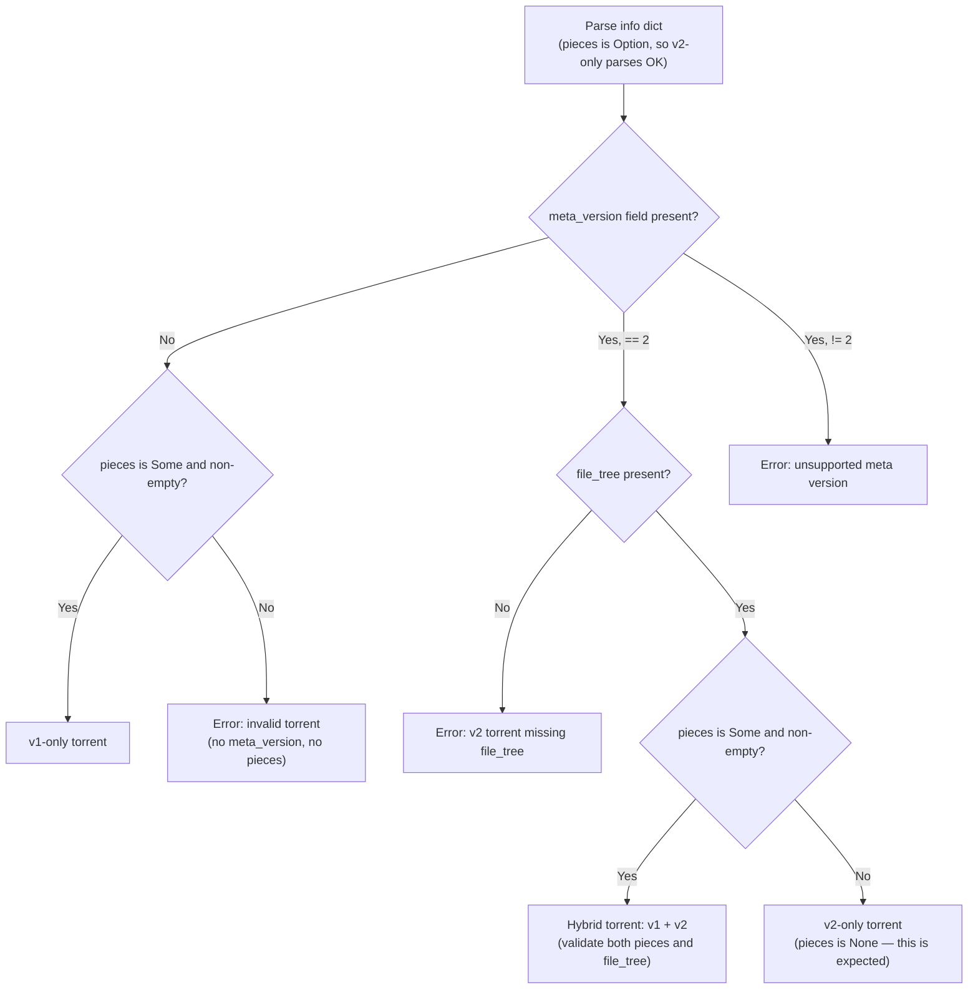

**Key change:** Because `pieces` is now `Option<BufType>`, the info dict deserializes
successfully for v2-only torrents where the `pieces` key is absent. The version detection
then branches on whether `pieces` is `Some` (hybrid) or `None` (v2-only).

### 5.3 Bencode Deserialization: Dual Hash Computation

**File:** `crates/librqbit_core/src/torrent_metainfo.rs`, function `torrent_from_bytes`

Currently:
```rust
pub fn torrent_from_bytes(buf: &[u8]) -> Result<TorrentMetaV1<ByteBuf>> {
    let mut t: TorrentMetaV1<ByteBuf> = bencode::from_bytes(buf)?;
    let mut digest = sha1w::Sha1::new();
    digest.update(t.info.raw_bytes.as_ref());
    t.info_hash = Id20::new(digest.finish());
    Ok(t)
}
```

After Phase 1:
```rust
pub fn torrent_from_bytes(buf: &[u8]) -> Result<TorrentMetaV1<ByteBuf>> {
    let mut t: TorrentMetaV1<ByteBuf> = bencode::from_bytes(buf)?;

    // Always compute SHA-1 info hash from the raw info bytes.
    //
    // DESIGN DECISION: We compute SHA-1 even for v2-only torrents.
    // This is a convenience — `info_hash: Id20` stays non-optional, so
    // existing code that needs a 20-byte identifier (session maps, logging,
    // persistence keys) doesn't need Option-handling everywhere. For v2-only
    // torrents the SHA-1 hash is NOT the canonical identifier and MUST NOT
    // be used for DHT, tracker announces, or handshakes (use the truncated
    // SHA-256 instead — see `Id32::truncate_for_dht()`).
    //
    // Version detection does NOT use info_hash to determine v1 presence;
    // it checks `has_v1_fields()` (pieces blob present). So computing
    // SHA-1 here does not cause a v2-only torrent to be misclassified as
    // hybrid.
    let raw_info = t.info.raw_bytes.as_ref();
    let mut sha1_digest = sha1w::Sha1::new();
    sha1_digest.update(raw_info);
    t.info_hash = Id20::new(sha1_digest.finish());

    // Compute SHA-256 info hash if v2 metadata is present
    if t.info.data.meta_version == Some(2) {
        let mut sha256_digest = sha1w::Sha256::new();
        sha256_digest.update(raw_info);
        t.info_hash_v2 = Some(Id32::new(sha256_digest.finish()));
    }

    Ok(t)
}
```

The key insight: **both hashes are computed from the same `raw_bytes`** (the raw bencode-encoded `info` dictionary). The `WithRawBytes` wrapper already captures this. No changes to the bencode deserializer itself are needed.

### 5.3.1 Piece Layers Validation

**BEP 52 requires** that `piece layers` is present in `.torrent` files containing v2
metadata and that each entry is consistent with the corresponding `pieces_root` in the
file tree. This validation runs after deserialization, before the torrent is accepted.

```rust
/// Validate piece_layers against the v2 file tree.
///
/// Called after torrent_from_bytes() for .torrent files (NOT for magnet links,
/// where piece_layers arrives later via hash request/response).
///
/// BEP 52 rules:
///   - Files with size == 0 have no pieces_root and no entry.
///   - Files with size <= piece_length MUST have pieces_root but MUST NOT have
///     a piece_layers entry (the pieces_root IS the single piece hash).
///   - Files with size > piece_length MUST have a piece_layers entry
///     keyed by their `pieces_root`.
///   - Each entry value must be exactly `n_pieces * 32` bytes, where
///     n_pieces = ceil(file_size / piece_length).
///   - Rebuilding the merkle tree from the piece-layer hashes (padding
///     to power-of-2 with zero_hash()) must produce a root that matches
///     the file's `pieces_root`.
fn validate_piece_layers<BufType: AsRef<[u8]>>(
    torrent: &TorrentMetaV1<BufType>,
) -> anyhow::Result<()> {
    let piece_layers = torrent.piece_layers.as_ref()
        .context("v2 torrent from .torrent file missing piece layers")?;

    let piece_length = torrent.info.data.piece_length;
    let file_tree = torrent.info.data.file_tree.as_ref()
        .context("v2 torrent missing file_tree")?;

    for (path, entry) in flatten_file_tree(file_tree) {
        let file_len = entry.length;

        if file_len == 0 {
            // Zero-length files: no pieces_root, no piece_layers entry.
            ensure!(entry.pieces_root.is_none(),
                "zero-length file {path:?} must not have pieces_root");
            continue;
        }

        let pieces_root = entry.pieces_root
            .context(format!("non-empty file {path:?} missing pieces_root"))?;

        if file_len <= piece_length as u64 {
            // Single-piece file: pieces_root is the only hash, no layer entry.
            ensure!(!piece_layers.contains_key(&pieces_root),
                "file {path:?} (size <= piece_length) must NOT have a piece_layers entry");
            continue;
        }

        // Multi-piece file: must have a piece_layers entry.
        let layer_data = piece_layers.get(&pieces_root)
            .context(format!("missing piece_layers entry for file {path:?}"))?;

        let n_pieces = file_len.div_ceil(piece_length as u64) as usize;
        ensure!(layer_data.as_ref().len() == n_pieces * 32,
            "piece_layers for {path:?}: expected {} bytes, got {}",
            n_pieces * 32, layer_data.as_ref().len());

        // Verify merkle root from piece layer hashes matches pieces_root.
        let piece_hashes: Vec<Id32> = layer_data.as_ref()
            .chunks_exact(32)
            .map(|c| Id32::new(c.try_into().unwrap()))
            .collect();
        let computed_root = merkle::root_from_piece_layer(
            &piece_hashes,
            file_len,
            piece_length,
        )?;
        ensure!(computed_root == pieces_root,
            "piece_layers merkle root mismatch for {path:?}: \
             computed {computed_root:?}, expected {pieces_root:?}");
    }

    Ok(())
}
```

This adds a new helper to `merkle.rs`:

```rust
/// Rebuild the merkle root from piece-layer hashes.
/// Pads the layer to a power-of-2 count using zero_hash(), then
/// hashes pairs upward to produce the root.
pub fn root_from_piece_layer(piece_hashes: &[Id32]) -> Id32 {
    let n = piece_hashes.len().next_power_of_two();
    let mut layer: Vec<Id32> = piece_hashes.to_vec();
    layer.resize(n, zero_hash());
    while layer.len() > 1 {
        layer = layer.chunks_exact(2)
            .map(|pair| hash_pair(&pair[0], &pair[1]))
            .collect();
    }
    layer[0]
}
```

### 5.4 v2 File Tree Validation and Flattening

To reuse existing `FileOps`, `ChunkTracker`, and `Lengths` infrastructure, the v2 file tree must be validated and flattened into an ordered list of `(path_components, V2FileEntry)` tuples. The order is determined by raw byte-string comparison of keys at each level (bencode dict ordering), which `BTreeMap<ByteBuf>` provides naturally via its `Ord` implementation on `&[u8]`. This is **not** Unicode collation — it is plain unsigned byte order, matching the BEP 52 requirement.

Validation and flattening happen together during a single DFS traversal. This
ensures every path component is checked before it is used.

```rust
impl<BufType: AsRef<[u8]> + Ord> TorrentMetaV2Info<BufType> {
    /// Validate the file tree and flatten into an ordered list of (path, entry)
    /// pairs, sorted by raw byte order of path components at each level
    /// (matching BEP 52 bencode dict key ordering, NOT Unicode collation).
    /// Returns an error if any BEP 52 constraint is violated.
    ///
    /// Validation checks (see §5.2.1 for full list):
    ///   - Root is a directory (not a file entry)
    ///   - No ".." or "." path components (traversal prevention)
    ///   - No "/" or "\" within path components
    ///   - No empty path component keys
    ///   - At least one file in the tree
    ///   - Unique file paths (after flattening)
    pub fn validate_and_flatten_files(
        &self,
    ) -> anyhow::Result<Vec<(Vec<&BufType>, &V2FileEntry<BufType>)>> {
        // Verify root is a directory
        // (file_tree is BTreeMap, so it's always a directory by construction,
        //  but the custom Deserialize impl must reject a root-level "" key)

        let mut files = Vec::new();
        let mut path_stack: Vec<&BufType> = Vec::new();
        self.flatten_recursive(&self.file_tree, &mut path_stack, &mut files)?;

        ensure!(!files.is_empty(), "v2 file tree contains no files");

        // Check for duplicate paths
        let mut seen = HashSet::new();
        for (path, _) in &files {
            let joined: Vec<&[u8]> = path.iter().map(|b| b.as_ref()).collect();
            ensure!(seen.insert(joined.clone()),
                "duplicate file path in v2 file tree: {joined:?}");
        }

        Ok(files)
    }

    fn flatten_recursive<'a>(
        &'a self,
        node: &'a BTreeMap<BufType, V2FileTreeNode<BufType>>,
        path_stack: &mut Vec<&'a BufType>,
        files: &mut Vec<(Vec<&'a BufType>, &'a V2FileEntry<BufType>)>,
    ) -> anyhow::Result<()> {
        for (key, child) in node {
            let key_bytes = key.as_ref();

            // Validate path component (skip "" sentinel — handled by enum)
            ensure!(!key_bytes.is_empty(),
                "empty path component in v2 file tree at depth {}",
                path_stack.len());
            ensure!(key_bytes != b".." && key_bytes != b".",
                "path traversal component {:?} in v2 file tree",
                String::from_utf8_lossy(key_bytes));
            ensure!(!memchr::memchr(b'/', key_bytes).is_some()
                    && !memchr::memchr(b'\\', key_bytes).is_some(),
                "path separator in v2 file tree component {:?}",
                String::from_utf8_lossy(key_bytes));

            match child {
                V2FileTreeNode::File(entry) => {
                    path_stack.push(key);
                    files.push((path_stack.clone(), entry));
                    path_stack.pop();
                }
                V2FileTreeNode::Directory(children) => {
                    path_stack.push(key);
                    self.flatten_recursive(children, path_stack, files)?;
                    path_stack.pop();
                }
            }
        }
        Ok(())
    }
}
```

**Note on `BufType` and UTF-8:** Bencode dictionary keys are byte strings with no
encoding guarantee. Using `BufType` (backed by `&[u8]` / `Bytes`) handles this
correctly. Display-facing code (logs, UI, error messages) should use
`String::from_utf8_lossy()`. The path components are written to the filesystem
using the same encoding-detection logic as v1 (`detect_encoding()`).

### 5.5 Validated v2 Info

Extend `ValidatedTorrentMetaV1Info` to carry v2 data:

```rust
pub struct ValidatedTorrentMetaV1Info<BufType> {
    encoding: &'static Encoding,
    lengths: Lengths,                          // v1 piece geometry
    info: TorrentMetaV1Info<BufType>,

    // --- NEW ---
    v2_lengths: Option<V2Lengths>,             // v2 per-file piece geometry
}
```

### 5.6 `V2Lengths`: Per-File Piece Geometry

v2 pieces are **file-aligned**: each file starts at a piece boundary, and pieces do not span files. The last piece of each file may be shorter than `piece_length`.

```rust
/// Per-file piece geometry for v2 torrents.
#[derive(Debug, Clone)]
pub struct V2Lengths {
    piece_length: u32,
    /// For each file: (file_index, num_pieces, total_file_length)
    files: Vec<V2FilePieceInfo>,
    /// Total number of pieces across all files.
    total_pieces: u32,
}

#[derive(Debug, Clone)]
pub struct V2FilePieceInfo {
    pub file_index: usize,
    pub file_length: u64,
    pub num_pieces: u32,
    /// The piece index of this file's first piece within the global piece space.
    pub first_piece_index: u32,
}

impl V2Lengths {
    /// Given a global v2 piece index, return which file it belongs to
    /// and the piece's offset within that file.
    pub fn file_for_piece(&self, piece: ValidPieceIndex) -> Option<(usize, u64)> { ... }

    /// Length of a specific piece (last piece of a file may be shorter).
    pub fn piece_length(&self, piece: ValidPieceIndex) -> u32 { ... }
}
```

### 5.7 Component Diagram: Phase 1

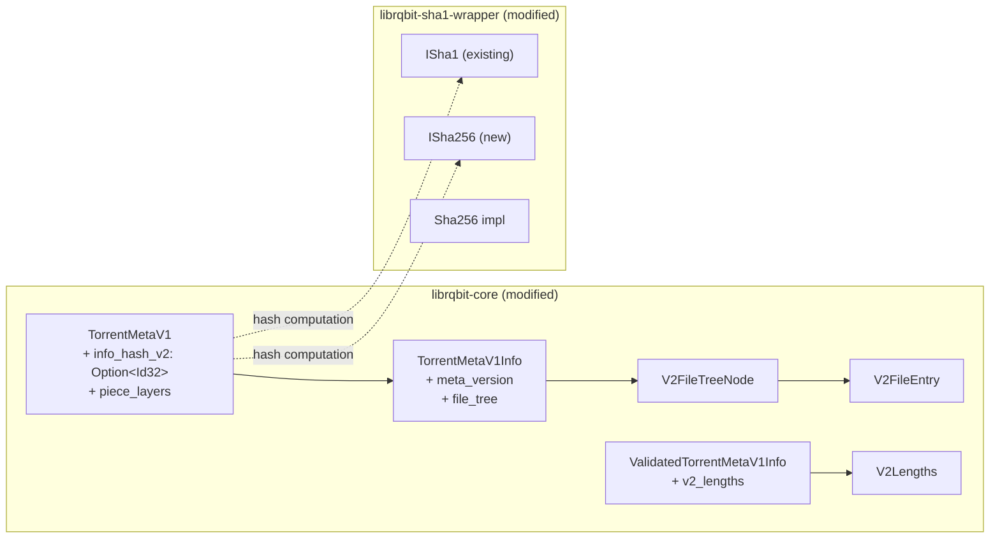

---

## 6. Phase 2: Merkle Tree Verification

### 6.1 BEP 52 Merkle Tree Specification

Each file in a v2 torrent has its own merkle tree:

- **Leaf nodes:** SHA-256 hash of each 16 KiB block of the file.
- **Branching factor:** 2 (binary tree).
- **Padding:** The tree is padded to a power-of-2 number of leaves. Padding leaves are **all-zero hashes** (32 bytes of `0x00`), NOT the SHA-256 of any data. This is per BEP 52: "the remaining leaf hashes beyond the end of the file required to construct the full Merkle tree are set to zero."
- **Root:** The `pieces root` stored in the file tree entry.
- **Piece hashes:** The layer of the tree where each node covers exactly `piece_length` bytes. These are stored in `piece layers`. **Only piece hashes that cover at least one byte of actual file data are included**; trailing piece hashes that cover only beyond-EOF padding are omitted from the `piece layers` dictionary.

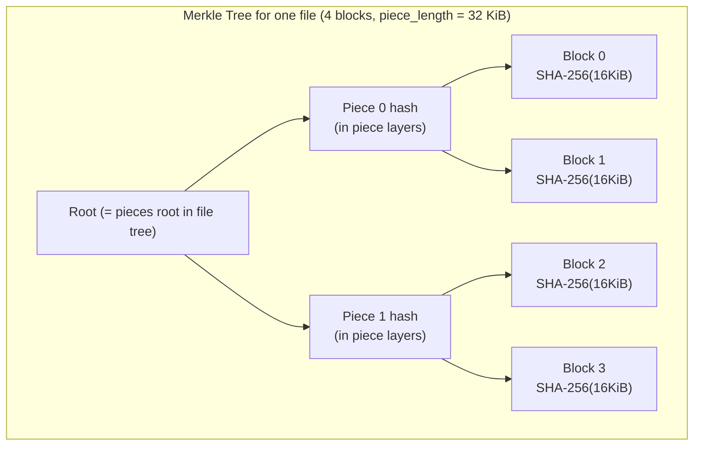

For larger files where `piece_length` covers more than 2 blocks, the tree has additional intermediate layers between the block leaves and the piece layer.

### 6.2 Merkle Tree Module

**New file:** `crates/librqbit_core/src/merkle.rs`

```rust
use crate::hash_id::Id32;

/// The fixed block size for v2 merkle trees (16 KiB).
pub const MERKLE_BLOCK_SIZE: u32 = 16384;

/// All-zero hash (32 bytes of 0x00). Used as padding leaf in merkle trees
/// for leaves beyond EOF. Per BEP 52, these are NOT the hash of any data,
/// but literal zero-valued hashes.
/// Computed once at compile time or as a constant.
pub fn zero_hash() -> Id32 {
    Id32::new([0u8; 32])
}

/// Compute SHA-256 of a data block (up to 16 KiB).
/// The block is NOT padded to 16 KiB before hashing.
pub fn hash_block(data: &[u8]) -> Id32 {
    let mut h = Sha256::new();
    h.update(data);
    Id32::new(h.finish())
}

/// Compute the parent hash from two children: SHA-256(left || right).
pub fn hash_pair(left: &Id32, right: &Id32) -> Id32 {
    let mut h = Sha256::new();
    h.update(&left.0);
    h.update(&right.0);
    Id32::new(h.finish())
}

/// Compute the merkle root for a file given its block hashes.
///
/// The tree is padded to the next power-of-2 number of leaves.
/// Padding leaves use `zero_hash()` (all-zero bytes), per BEP 52.
///
/// Returns the root hash and the piece layer hashes.
/// Piece layer hashes that cover only beyond-EOF padding are **omitted**.
pub fn compute_merkle_root(
    block_hashes: &[Id32],
    blocks_per_piece: u32,
) -> MerkleResult {
    ...
}

pub struct MerkleResult {
    /// The merkle root (= pieces root for the file tree entry).
    pub root: Id32,
    /// Piece-layer hashes. Only includes hashes for pieces that cover at least
    /// one byte of actual file data; trailing beyond-EOF pieces are omitted.
    /// These go into the `piece layers` dictionary.
    pub piece_hashes: Vec<Id32>,
}

/// Verify that a set of block hashes, combined with proof hashes,
/// produces the expected piece hash.
pub fn verify_piece(
    block_hashes: &[Id32],
    expected_piece_hash: &Id32,
    blocks_per_piece: u32,
) -> bool {
    ...
}

/// Verify a single block against a merkle proof path up to the piece root.
/// Used for per-block verification when receiving hash responses from peers.
pub fn verify_block_with_proof(
    block_hash: &Id32,
    block_index_in_piece: u32,
    proof: &[Id32],
    expected_piece_hash: &Id32,
) -> bool {
    ...
}
```

### 6.3 Merkle Tree Construction Algorithm

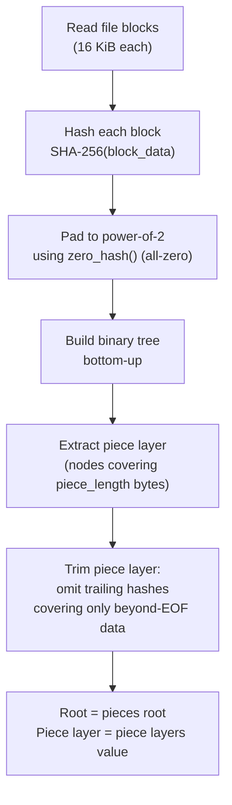

**Detailed algorithm:**

```
function compute_merkle_root(block_hashes, blocks_per_piece):
    // Step 1: Pad leaf count to next power of 2
    // BEP 52: padding leaves are all-zero hashes (32 bytes of 0x00),
    // NOT the hash of zero-filled data.
    n_leaves = next_power_of_2(len(block_hashes))
    leaves = block_hashes + [zero_hash()] * (n_leaves - len(block_hashes))

    // Step 2: Build tree bottom-up
    current_layer = leaves
    while len(current_layer) > 1:
        next_layer = []
        for i in range(0, len(current_layer), 2):
            next_layer.append(hash_pair(current_layer[i], current_layer[i+1]))
        current_layer = next_layer

    root = current_layer[0]

    // Step 3: Extract piece layer
    // The piece layer is the layer where each node covers blocks_per_piece leaves
    piece_layer = layer_at_depth(log2(n_leaves / blocks_per_piece))

    // Step 4: Trim piece layer — omit trailing entries that cover only
    // beyond-EOF padding. Only keep entries where at least one leaf
    // corresponds to actual file data.
    // BEP 52: "the number of piece layer hashes is not the same as the
    // number of pieces [in the padded tree]."
    n_data_pieces = ceil(len(block_hashes) / blocks_per_piece)
    piece_layer = piece_layer[0 .. n_data_pieces]

    return MerkleResult { root, piece_hashes: piece_layer }
```

### 6.4 Piece Verification: v2 Path

**File:** `crates/librqbit/src/file_ops.rs`

The existing `check_piece` must be extended. Rather than branching inside the function, we use a strategy pattern:

```rust
/// Strategy for piece hash verification.
pub(crate) enum PieceVerifier<'a> {
    /// v1: flat SHA-1 hash per piece spanning all files.
    V1 {
        torrent: &'a ValidatedTorrentMetaV1Info<ByteBufOwned>,
    },
    /// v2-only: SHA-256 merkle tree, pieces are file-aligned.
    V2 {
        torrent: &'a ValidatedTorrentMetaV1Info<ByteBufOwned>,
        piece_layers: &'a BTreeMap<Id32, Vec<u8>>,
    },
    /// Hybrid: must verify BOTH v1 (SHA-1) and v2 (SHA-256 merkle) hashes
    /// independently for every piece. BEP 52 requires that hybrid torrents
    /// describe identical content via both hash schemes; accepting a piece
    /// that passes only one check could let an inconsistent or malicious
    /// hybrid torrent corrupt data for peers using the other hash scheme.
    Hybrid {
        torrent: &'a ValidatedTorrentMetaV1Info<ByteBufOwned>,
        piece_layers: &'a BTreeMap<Id32, Vec<u8>>,
    },
}
```

**Hybrid verification semantics:** For `PieceVerifier::Hybrid`, `check_piece` must
run **both** the v1 SHA-1 flat-piece check **and** the v2 SHA-256 merkle check, and
the piece is accepted only if **both pass**. This is not a performance optimization
choice — it is a correctness requirement. A hybrid torrent that passes v2 but fails
v1 (or vice versa) indicates either a bug in the torrent creator or a malicious torrent
crafted to serve different content to v1 and v2 peers.

### 6.5 v2 Piece Verification Sequence

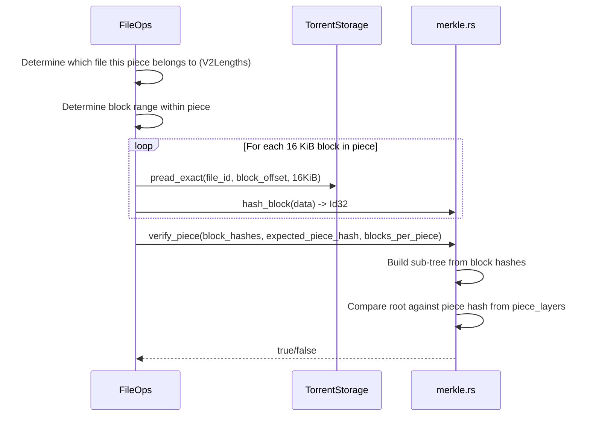

### 6.6 `check_piece` for v2

```rust
impl FileOps<'_> {
    pub fn check_piece_v2(
        &self,
        piece_index: ValidPieceIndex,
        v2_lengths: &V2Lengths,
        piece_layers: &BTreeMap<Id32, Vec<u8>>,
    ) -> anyhow::Result<bool> {
        // 1. Find which file this piece belongs to
        let (file_idx, offset_in_file) = v2_lengths.file_for_piece(piece_index)
            .context("invalid piece index for v2")?;

        // 2. Get the piece hash from piece_layers
        let file_info = &self.file_infos[file_idx];
        let pieces_root = /* from file_tree entry */;
        let layer_data = piece_layers.get(&pieces_root)
            .context("missing piece layers for file")?;
        let local_piece_idx = piece_index.get() - v2_lengths.files[file_idx].first_piece_index;
        let expected_hash = &layer_data[local_piece_idx as usize * 32..(local_piece_idx as usize + 1) * 32];

        // 3. Hash each 16 KiB block
        let piece_len = v2_lengths.piece_length(piece_index);
        let num_blocks = piece_len.div_ceil(MERKLE_BLOCK_SIZE);
        let mut block_hashes = Vec::with_capacity(num_blocks as usize);
        let mut buf = vec![0u8; MERKLE_BLOCK_SIZE as usize];

        for block_idx in 0..num_blocks {
            let block_offset = offset_in_file + block_idx as u64 * MERKLE_BLOCK_SIZE as u64;
            let block_size = std::cmp::min(
                MERKLE_BLOCK_SIZE,
                piece_len - block_idx * MERKLE_BLOCK_SIZE,
            );
            self.files.pread_exact(file_idx, block_offset, &mut buf[..block_size as usize])?;
            block_hashes.push(merkle::hash_block(&buf[..block_size as usize]));
        }

        // 4. Verify against merkle piece hash
        let expected = Id32::from_bytes(expected_hash)?;
        let blocks_per_piece = (v2_lengths.piece_length_default() / MERKLE_BLOCK_SIZE) as u32;
        Ok(merkle::verify_piece(&block_hashes, &expected, blocks_per_piece))
    }
}
```

### 6.7 `initial_check` for v2

The v2 initial check is simpler than v1 because pieces don't span files:

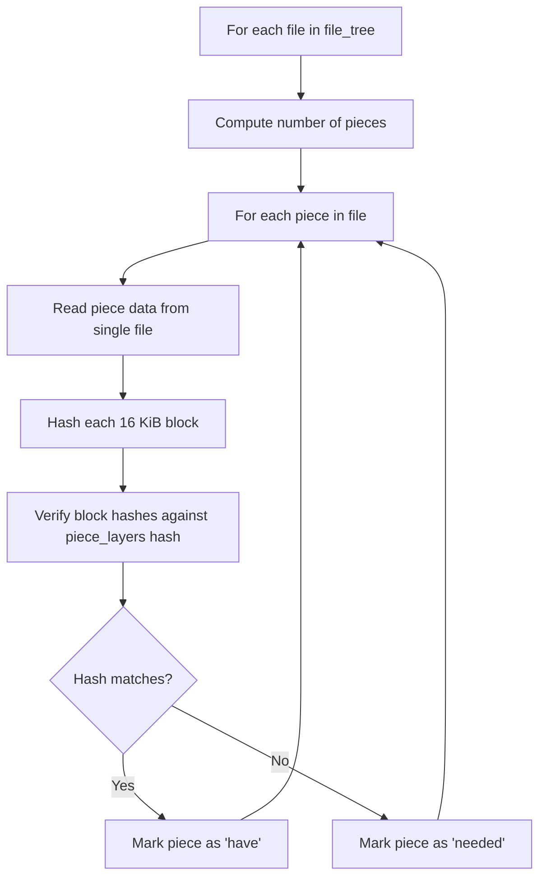

### 6.8 `compare_hash` Generalization

Add a v2-aware comparison method:

```rust
impl<BufType: AsRef<[u8]>> TorrentMetaV1Info<BufType> {
    // Existing v1 method (unchanged)
    pub fn compare_hash(&self, piece: u32, hash: [u8; 20]) -> Option<bool> { ... }

    // New v2 method
    pub fn compare_hash_v2(
        &self,
        piece_layers: &BTreeMap<Id32, Vec<u8>>,
        pieces_root: &Id32,
        local_piece_index: u32,
        computed_hashes: &[Id32],
        blocks_per_piece: u32,
    ) -> Option<bool> {
        let layer_data = piece_layers.get(pieces_root)?;
        let start = local_piece_index as usize * 32;
        let expected = layer_data.get(start..start + 32)?;
        let expected_id = Id32::from_bytes(expected).ok()?;
        Some(merkle::verify_piece(computed_hashes, &expected_id, blocks_per_piece))
    }
}
```

---

## 7. Phase 3: Peer Protocol Upgrade

### 7.1 Handshake Changes

**File:** `crates/peer_binary_protocol/src/lib.rs`

#### Reserved Bits

BEP 52 specifies: set bit 4 of the last reserved byte (byte index 7, 4th most significant bit) to indicate v2 support.

```rust
impl Handshake {
    pub fn new(info_hash: Id20, peer_id: Id20) -> Handshake {
        let mut reserved: u64 = 0;
        reserved |= 1 << 20;  // existing: extended messaging
        // v2 support bit will be set conditionally
        Handshake { reserved, info_hash, peer_id }
    }

    /// Set the v2 support bit in the reserved field.
    pub fn set_v2_support(&mut self) {
        // Bit 4 of byte 7 (last byte, 4th MSB)
        // In big-endian u64: bit position 4 from LSB
        self.reserved |= 1 << 4;
    }

    /// Check if peer supports v2.
    pub fn supports_v2(&self) -> bool {
        self.reserved.to_be_bytes()[7] & 0x10 > 0
    }
}
```

#### Handshake State Diagram

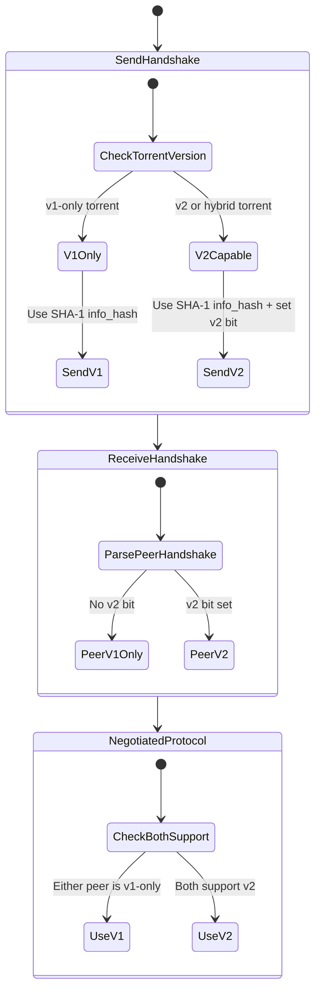

**Note:** The handshake always uses a 20-byte `info_hash` on the wire. For v2-only torrents, this is the **truncated** SHA-256 hash (first 20 bytes). For hybrid torrents, peers connect using the v1 SHA-1 hash but signal v2 capability via the reserved bit.

### 7.2 Hash Request/Response Messages (BEP 52 Section 5)

**Important:** BEP 52 defines Hash Request (21), Hash Reject (22), and Hash Hashes (23) as
**standard peer wire protocol messages** with fixed message IDs. They are **NOT** BEP 10
extended messages and do not require handshake negotiation. Implementing them as extended
messages would break interop with other clients.

**File:** `crates/peer_binary_protocol/src/hash_messages.rs` (new module)

#### Hash Message Structs

```rust
/// Standard peer wire message ID constants for BEP 52 hash messages.
pub const MSG_HASH_REQUEST: u8 = 21;
pub const MSG_HASH_HASHES: u8 = 22;   // BEP 4: 0x16
pub const MSG_HASH_REJECT: u8 = 23;   // BEP 4: 0x17

/// BEP 52 Hash Request (message ID 21).
/// Binary-encoded on the wire (not bencoded), following standard
/// peer wire framing: <length prefix><message ID><payload>.
#[derive(Debug, Clone)]
pub struct HashRequest {
    /// The merkle root of the file (32 bytes)
    pub pieces_root: Id32,
    /// Which layer of the tree to return (0 = block/leaf layer)
    pub base_layer: u32,
    /// Index within the requested layer
    pub index: u32,
    /// Number of hashes to return (must be power of 2)
    pub length: u32,
    /// Number of proof layer hashes to include
    pub proof_layers: u32,
}

/// BEP 52 Hash Hashes (message ID 22).
/// Response containing the requested hashes plus proof hashes.
#[derive(Debug)]
pub struct HashHashes<BufType> {
    /// The merkle root of the file (32 bytes)
    pub pieces_root: Id32,
    /// Which layer the base hashes are from
    pub base_layer: u32,
    /// Starting index in the base layer
    pub index: u32,
    /// Number of hashes to return
    pub length: u32,
    /// Number of proof layer hashes prepended before the base hashes
    pub proof_layers: u32,
    /// Concatenated 32-byte hashes: proof layers (top-down) then base layer
    pub hashes: BufType,
}

/// BEP 52 Hash Reject (message ID 23).
/// Sent when a hash request cannot be fulfilled. Same payload as HashRequest.
#[derive(Debug, Clone)]
pub struct HashReject {
    pub pieces_root: Id32,
    pub base_layer: u32,
    pub index: u32,
    pub length: u32,
    pub proof_layers: u32,
}
```

#### Top-Level Message Enum Update

These are standard protocol messages, so they belong in the top-level `Message` enum
alongside `Request`, `Piece`, `Bitfield`, etc. — **not** in `ExtendedMessage`:

```rust
pub enum Message<'a> {
    Request(Request),
    Cancel(Request),
    Bitfield(ByteBuf<'a>),
    KeepAlive,
    Have(u32),
    Choke,
    Unchoke,
    Interested,
    NotInterested,
    Piece(Piece<ByteBuf<'a>>),
    Extended(ExtendedMessage<ByteBuf<'a>>),
    // NEW — BEP 52 standard messages (fixed IDs 21, 22, 23)
    HashRequest(HashRequest),
    HashHashes(HashHashes<ByteBuf<'a>>),
    HashReject(HashReject),
}
```

The `ExtendedMessage` enum and `PeerExtendedMessageIds` are **unchanged** — hash messages
do not participate in BEP 10 extended handshake negotiation.

#### Serialization / Deserialization

Hash messages use standard peer wire framing (big-endian length prefix + message ID),
with binary-encoded fixed-layout payloads (not bencoded):

```
HashRequest (ID 21):  <32: pieces_root><4: base_layer><4: index><4: length><4: proof_layers>
HashHashes  (ID 22):  <32: pieces_root><4: base_layer><4: index><4: length><4: proof_layers><N*32: hashes>
HashReject  (ID 23):  <32: pieces_root><4: base_layer><4: index><4: length><4: proof_layers>
```

Add arms to the existing `Message::serialize` and deserialization match:

```rust
// In Message::serialize
Message::HashRequest(req) => {
    let payload_len = 32 + 4 + 4 + 4 + 4; // 48 bytes
    write_preamble!(payload_len as u32, MSG_HASH_REQUEST);
    out[5..37].copy_from_slice(&req.pieces_root.0);
    out[37..41].copy_from_slice(&req.base_layer.to_be_bytes());
    out[41..45].copy_from_slice(&req.index.to_be_bytes());
    out[45..49].copy_from_slice(&req.length.to_be_bytes());
    out[49..53].copy_from_slice(&req.proof_layers.to_be_bytes());
    Ok(53)
}

// In deserialization
MSG_HASH_REQUEST => {
    ensure!(payload.len() == 48, "invalid hash_request length");
    Message::HashRequest(HashRequest {
        pieces_root: Id32::new(payload[0..32].try_into()?),
        base_layer: u32::from_be_bytes(payload[32..36].try_into()?),
        index: u32::from_be_bytes(payload[36..40].try_into()?),
        length: u32::from_be_bytes(payload[40..44].try_into()?),
        proof_layers: u32::from_be_bytes(payload[44..48].try_into()?),
    })
}
// HashHashes (22) has variable-length hashes tail; HashReject (23) same layout as HashRequest.
```

### 7.3 DHT and Tracker Compatibility

**DHT** uses 20-byte node IDs. For v2 torrents, the SHA-256 info hash is **truncated to 20 bytes** for DHT operations:

```rust
impl Id32 {
    /// Truncate to 20 bytes for DHT compatibility (BEP 52).
    pub fn truncate_for_dht(&self) -> Id20 {
        let mut bytes = [0u8; 20];
        bytes.copy_from_slice(&self.0[..20]);
        Id20::new(bytes)
    }
}
```

**Tracker announces** for hybrid torrents: announce under **both** hashes (separate requests). v2-only torrents use the truncated hash.

### 7.4 Peer Connection Handler Changes

```rust
pub trait PeerConnectionHandler {
    // Existing methods unchanged...

    /// Called when peer sends a v2 hash request.
    async fn on_hash_request(&self, _req: HashRequest) -> anyhow::Result<()> {
        Ok(()) // Default: ignore (v1-only handler)
    }

    /// Called when peer sends v2 hashes (message ID 22).
    async fn on_hash_hashes(&self, _resp: HashHashes<ByteBuf>) -> anyhow::Result<()> {
        Ok(()) // Default: ignore
    }
}
```

---

## 8. Phase 4: Torrent Creation

### 8.1 Extended `CreateTorrentOptions`

**File:** `crates/librqbit/src/create_torrent_file.rs`

```rust
#[derive(Debug, Clone, Copy, PartialEq, Eq)]
pub enum TorrentVersion {
    V1Only,
    V2Only,
    Hybrid,
}

#[derive(Debug, Clone, Default)]
pub struct CreateTorrentOptions<'a> {
    pub name: Option<&'a str>,
    pub trackers: Vec<String>,
    pub piece_length: Option<u32>,
    // NEW
    pub version: Option<TorrentVersion>,  // Default: V1Only for backward compat
}
```

### 8.2 Torrent Creation Sequence

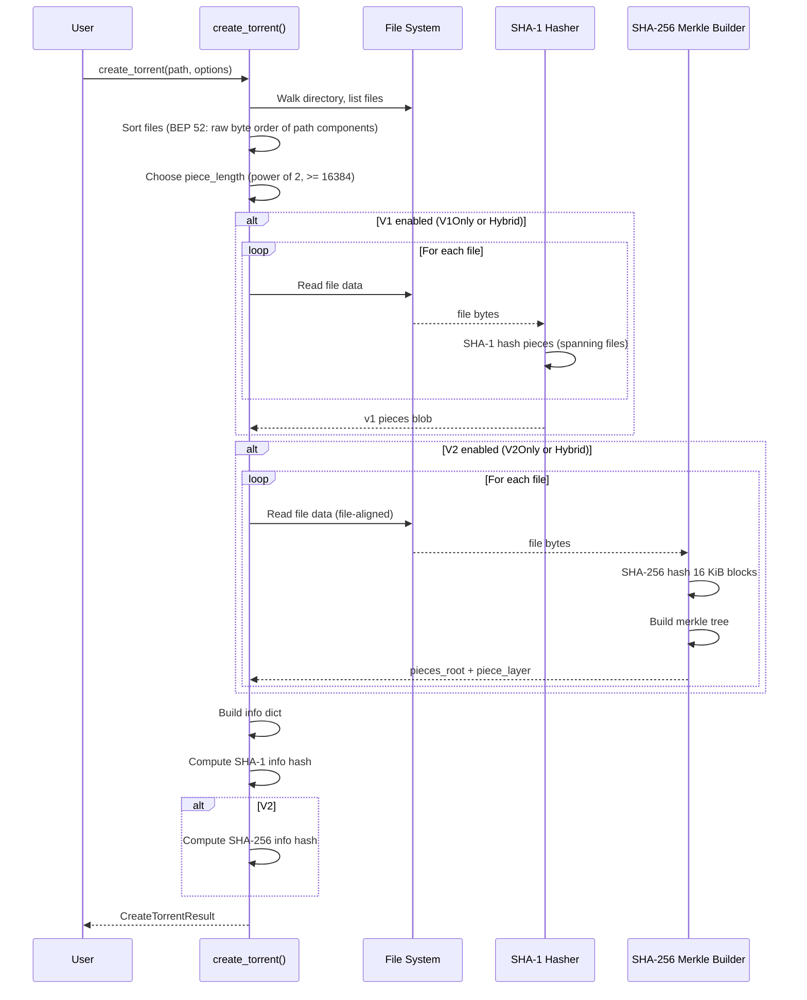

### 8.3 File Alignment for v2

BEP 52 requires each file to start at a piece boundary. For v2 and hybrid creation:

```
File A: 100,000 bytes, piece_length = 65536
  -> File A occupies pieces 0, 1 (piece 1 is partial: 34,464 bytes)
  -> File A's last piece merkle leaves beyond EOF use zero_hash() (all-zero)

File B: 50,000 bytes
  -> File B starts at piece 2 (NOT continuing from File A's last piece)
  -> File B occupies piece 2 (50,000 bytes, partial)
```

For **v1** in hybrid torrents, files are still concatenated (pieces span files), but padding files are inserted to maintain alignment. This is handled automatically.

### 8.4 Dual Pipeline Architecture

Following libtorrent's design, the two hashing pipelines are **completely independent**:

```rust
struct TorrentCreationPipelines {
    v1: Option<V1Pipeline>,
    v2: Option<V2Pipeline>,
}

struct V1Pipeline {
    piece_hasher: Sha1,
    pieces: Vec<u8>,         // Concatenated 20-byte SHA-1 hashes
    remaining_piece: u32,
}

struct V2Pipeline {
    block_hasher: Sha256,
    file_block_hashes: Vec<Id32>,  // Block hashes for current file
    file_trees: BTreeMap<ByteBufOwned, V2FileTreeNode<ByteBufOwned>>,
    piece_layers: BTreeMap<Id32, Vec<u8>>,
}
```

---

## 9. Cross-Cutting Concerns

### 9.1 `ManagedTorrentShared` Changes

```rust
pub struct ManagedTorrentShared {
    pub id: TorrentId,
    pub info_hash: Id20,
    // NEW
    pub info_hash_v2: Option<Id32>,

    pub(crate) spawner: BlockingSpawner,
    pub trackers: HashSet<url::Url>,
    pub peer_id: Id20,
    // ...
}
```

### 9.2 `TorrentMetadata` Changes

```rust
pub struct TorrentMetadata {
    pub info: ValidatedTorrentMetaV1Info<ByteBufOwned>,
    pub torrent_bytes: Bytes,
    pub info_bytes: Bytes,
    pub file_infos: FileInfos,
    // NEW
    /// Validated piece layers for v2/hybrid torrents.
    ///
    /// `Some` after loading from a .torrent file (validated by
    /// `validate_piece_layers()` — every multi-piece file has an entry
    /// whose merkle root matches `pieces_root`).
    ///
    /// `None` only when the torrent was added via magnet link and
    /// piece layers have not yet been fetched from peers. In this state,
    /// download cannot begin until layers are obtained via hash
    /// request/response (BEP 52 §5).
    ///
    /// For v1-only torrents this is always `None`.
    pub piece_layers: Option<BTreeMap<Id32, Vec<u8>>>,
}
```

### 9.3 Session `add_torrent` Flow Changes

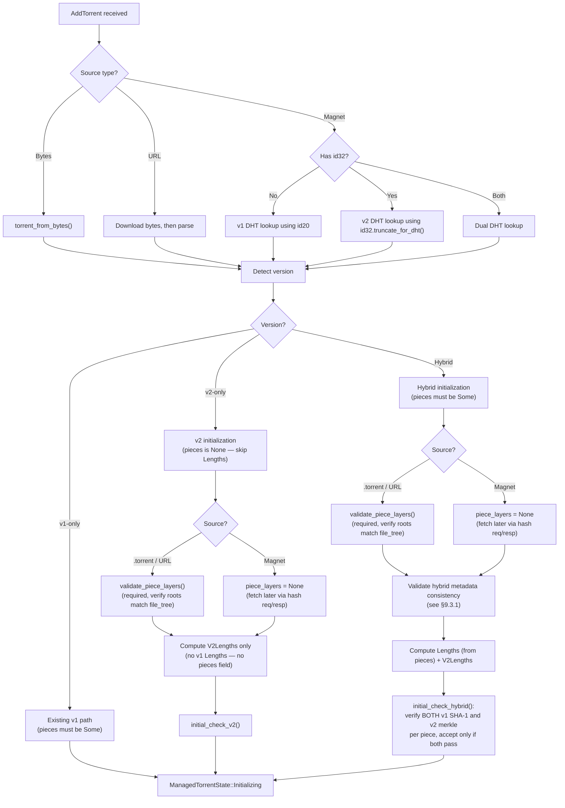

### 9.3.1 Hybrid Metadata Consistency Validation

BEP 52 requires that the v1 and v2 metadata in a hybrid torrent describe **identical
content**. Before accepting a hybrid torrent, the following cross-checks must pass at
load time (in `validate()` or the hybrid initialization path):

```rust
/// Validate that v1 and v2 metadata in a hybrid torrent are consistent.
/// Called during hybrid torrent initialization, before initial_check.
fn validate_hybrid_consistency(
    info: &TorrentMetaV1Info<ByteBufOwned>,
    v1_lengths: &Lengths,
    v2_lengths: &V2Lengths,
) -> anyhow::Result<()> {
    // 1. File count: v1 file list (excluding padding files) must match
    //    the number of files in the v2 file_tree.
    //    v1 padding files (attr="p") are not real files — skip them.

    // 2. File sizes: Each real file's length in v1 must match
    //    the corresponding v2 file_tree entry's length, in order.

    // 3. File names: Each real file's path in v1 must match
    //    the corresponding v2 file_tree path.

    // 4. piece_length must be the same for both (it's a single field,
    //    but verify it is valid for both v1 and v2 constraints:
    //    v2 requires piece_length >= 16 KiB and power-of-two).

    // 5. Total content length derived from v1 files (excluding padding)
    //    must equal total content length from v2 file_tree.

    Ok(())
}
```

**At download time**, every piece in a hybrid torrent must pass both hash checks:

1. **v1 check:** SHA-1 of the piece data matches the corresponding 20-byte entry in the
   `pieces` blob. For pieces that span files (v1 layout), data is read across file
   boundaries including padding file regions.
2. **v2 check:** SHA-256 merkle verification of the file-aligned piece against the
   piece layer hash from `piece_layers`.
3. **Accept only if both pass.** If either check fails, the piece is rejected.

This dual verification prevents a malicious hybrid torrent from serving different content
to v1-only and v2-capable peers. It also catches bugs in torrent creators that produce
inconsistent hybrid metadata.

### 9.4 ChunkTracker Impact

`ChunkTracker` tracks pieces as a bitfield. For v2 torrents, the piece numbering changes (file-aligned), but the tracker itself doesn't need structural changes -- it just operates on a different `Lengths`/`V2Lengths`.

For hybrid torrents, piece tracking uses the v2 piece geometry (file-aligned). A piece
is marked "have" only after **both** the v1 SHA-1 and v2 SHA-256 merkle checks pass
(see `PieceVerifier::Hybrid`). There is no separate derivation of v1 status from v2
status — both are independently verified against the downloaded data before the piece
is accepted.

### 9.5 Storage Impact

`TorrentStorage` is unaffected. v2 piece writes still go through `pwrite_all_vectored`. The only difference is that piece data never spans files for v2, simplifying the write path.

---

## 10. Test Strategy

### 10.1 Unit Tests

| Test | File | Description |
|------|------|-------------|
| `test_sha256_basic` | `sha1w/src/lib.rs` | Verify SHA-256 output against known vectors |
| `test_sha256_empty` | `sha1w/src/lib.rs` | SHA-256 of empty input |
| `test_merkle_single_block` | `librqbit_core/src/merkle.rs` | Single-block file: root == block hash |
| `test_merkle_two_blocks` | `librqbit_core/src/merkle.rs` | Two blocks: root == SHA-256(h0 \|\| h1) |
| `test_merkle_padding` | `librqbit_core/src/merkle.rs` | 3 blocks: padded to 4, verify padding hash |
| `test_merkle_large_file` | `librqbit_core/src/merkle.rs` | 1000 blocks, verify layer extraction |
| `test_merkle_verify_piece` | `librqbit_core/src/merkle.rs` | Verify piece from block hashes |
| `test_merkle_verify_block_proof` | `librqbit_core/src/merkle.rs` | Verify single block with proof path |
| `test_v2_file_tree_parse` | `librqbit_core/src/torrent_metainfo.rs` | Parse v2 file tree from bencode |
| `test_v2_file_tree_flatten` | `librqbit_core/src/torrent_metainfo.rs` | Flatten nested tree to file list |
| `test_v2_file_tree_single_file` | `librqbit_core/src/torrent_metainfo.rs` | Single-file v2 torrent |
| `test_v2_file_tree_root_is_file` | `librqbit_core/src/torrent_metainfo.rs` | Root-level `""` key (file at root) → rejected |
| `test_v2_file_tree_dotdot` | `librqbit_core/src/torrent_metainfo.rs` | `..` path component → path traversal error |
| `test_v2_file_tree_dot` | `librqbit_core/src/torrent_metainfo.rs` | `.` path component → rejected |
| `test_v2_file_tree_separator_in_key` | `librqbit_core/src/torrent_metainfo.rs` | `/` or `\` in key → rejected |
| `test_v2_file_tree_empty_key` | `librqbit_core/src/torrent_metainfo.rs` | Empty non-sentinel key → rejected |
| `test_v2_file_tree_no_files` | `librqbit_core/src/torrent_metainfo.rs` | Tree with only dirs, no files → rejected |
| `test_v2_file_tree_duplicate_paths` | `librqbit_core/src/torrent_metainfo.rs` | Two files at same path → rejected |
| `test_v2_file_tree_non_utf8_key` | `librqbit_core/src/torrent_metainfo.rs` | Non-UTF-8 key bytes parse OK, display with lossy |
| `test_v2_lengths` | `librqbit_core/src/lengths.rs` | Per-file piece geometry |
| `test_v2_lengths_last_piece_short` | `librqbit_core/src/lengths.rs` | Last piece of file shorter |
| `test_version_detection_v1` | `librqbit_core/src/torrent_metainfo.rs` | v1-only detection |
| `test_version_detection_v2` | `librqbit_core/src/torrent_metainfo.rs` | v2-only detection |
| `test_version_detection_hybrid` | `librqbit_core/src/torrent_metainfo.rs` | Hybrid detection |
| `test_dual_hash_computation` | `librqbit_core/src/torrent_metainfo.rs` | Both SHA-1 and SHA-256 from same raw bytes |
| `test_handshake_v2_bit` | `peer_binary_protocol/src/lib.rs` | Set/check v2 bit in reserved |
| `test_handshake_v2_roundtrip` | `peer_binary_protocol/src/lib.rs` | Serialize/deserialize with v2 bit |
| `test_id32_truncate_for_dht` | `librqbit_core/src/hash_id.rs` | SHA-256 -> 20-byte truncation |
| `test_validate_piece_layers_ok` | `librqbit_core/src/torrent_metainfo.rs` | Valid piece layers accepted, roots match file_tree |
| `test_validate_piece_layers_missing` | `librqbit_core/src/torrent_metainfo.rs` | v2 .torrent with no piece layers → error |
| `test_validate_piece_layers_missing_entry` | `librqbit_core/src/torrent_metainfo.rs` | Multi-piece file missing from piece layers → error |
| `test_validate_piece_layers_wrong_length` | `librqbit_core/src/torrent_metainfo.rs` | Entry byte count != n_pieces * 32 → error |
| `test_validate_piece_layers_root_mismatch` | `librqbit_core/src/torrent_metainfo.rs` | Tampered piece hash → computed root != pieces_root → error |
| `test_validate_piece_layers_small_file_no_entry` | `librqbit_core/src/torrent_metainfo.rs` | File <= piece_length must NOT have entry |
| `test_root_from_piece_layer` | `librqbit_core/src/merkle.rs` | Rebuild root from piece layer matches compute_merkle_root |
| `test_hash_request_serialize` | `peer_binary_protocol/src/hash_messages.rs` | Hash request message (standard msg ID 21) |
| `test_hash_hashes_serialize` | `peer_binary_protocol/src/hash_messages.rs` | Hash hashes message (standard msg ID 23) |

### 10.2 Integration Tests

Following the existing pattern in `crates/librqbit/src/tests/`:

#### Test: v2 Torrent Round-Trip

```
1. Generate random files on disk
2. Create v2-only .torrent via create_torrent(version: V2Only)
3. Deserialize the .torrent back (must succeed with pieces: None)
4. Verify pieces is None (v2-only omits the pieces key)
5. Verify SHA-256 info hash matches
6. Verify piece_layers present and non-empty
7. Verify file_tree structure matches file layout
8. Run initial_check_v2() -> all pieces should be "have"
```

#### Test: Hybrid Torrent Round-Trip

```
1. Generate random files
2. Create hybrid .torrent via create_torrent(version: Hybrid)
3. Verify both info_hash (SHA-1) and info_hash_v2 (SHA-256) present
4. Verify v1 pieces blob present (pieces is Some)
5. Verify v2 file_tree and piece_layers present
6. Run validate_hybrid_consistency() -> passes
   a. File count matches (v1 real files == v2 file_tree files)
   b. File sizes match pairwise
   c. File names match pairwise
   d. Total content length matches
7. Run initial_check_hybrid() -> all pieces pass BOTH v1 and v2 checks
8. Verify v1-only initial_check() independently -> all have
9. Verify v2-only initial_check_v2() independently -> all have
```

#### Test: Inconsistent Hybrid Rejection

```
1. Create a valid hybrid .torrent
2. Tamper with v1 pieces blob (corrupt one SHA-1 hash) while keeping v2 intact
3. Run initial_check_hybrid() -> tampered piece must FAIL (v1 mismatch)
4. Tamper with v2 piece_layers (corrupt one merkle hash) while keeping v1 intact
5. Run initial_check_hybrid() -> tampered piece must FAIL (v2 mismatch)
6. Tamper with v1 file list (change a file length) while keeping v2 intact
7. Run validate_hybrid_consistency() -> must FAIL (size mismatch)
```

#### Test: v2 E2E Download

Extends existing `e2e.rs` pattern:

```
1. Create v2 .torrent
2. Spawn N seeding sessions
3. Spawn downloading session
4. Downloader requests pieces, verifies via merkle
5. Verify downloaded content matches source
6. Verify proper cleanup (drop checks)
```

### 10.3 Interoperability Tests

Test against `.torrent` files generated by libtorrent:

| Test File | Type | Source | Validates |
|-----------|------|--------|-----------|
| `bittorrent-v2-test.torrent` | v2-only | libtorrent reference | v2 parsing, merkle verification |
| `bittorrent-v1-v2-hybrid-test.torrent` | hybrid | libtorrent reference | Hybrid parsing, dual hash |
| `rqbit-created-v2.torrent` | v2-only | rqbit (our output) | Creation correctness |

These test torrent files should be added to `crates/librqbit/resources/test/`.

### 10.4 Test Pattern Reference

The existing test infrastructure uses these patterns (from `tests/e2e.rs`):

- `create_default_random_dir_with_torrents(num_files, file_length)` - creates test content
- `Session::new_with_opts()` with `disable_dht: true` for isolated tests
- `DropChecks` for verifying Arc cleanup
- `tokio::time::timeout()` wrapping with `E2E_TIMEOUT` env var
- Multi-server seeding with configurable transport (TCP/UTP)
- `#[tokio::test(flavor = "multi_thread")]`

---

## 11. Migration & Compatibility

### 11.1 Backward Compatibility Guarantees

1. **Existing v1 torrents:** Zero behavioral change. The v2 fields are `Option<T>` and default to `None` during deserialization of v1 torrents.

2. **Existing API consumers:** `info_hash: Id20` field unchanged. `as_id20()` accessor unchanged. Code that doesn't touch v2 fields compiles and runs identically.

3. **Wire protocol:** v1 peers see no difference. The v2 reserved bit is in a position that v1 clients ignore. Hash request/reject/hashes messages use fixed standard protocol IDs (21/22/23), not BEP 10 extended negotiation; v1 clients simply ignore unknown message IDs.

4. **DHT:** Continues to use 20-byte keys. v2 hashes are truncated.

### 11.2 Semver Impact

Following the pre-1.0 policy from the contribution plan:

| Crate | Current | New | Breaking? |
|-------|---------|-----|-----------|
| librqbit-core | 5.x | 6.0 | Yes: new fields on public structs |
| librqbit-sha1-wrapper | 4.1 | 4.2 | No: additive (new trait) |
| librqbit-peer-protocol | 4.3 | 5.0 | Yes: new Handshake method, new Message variants (HashRequest/HashReject/HashHashes) |
| librqbit | 9.0.0-beta | 9.0.0-beta | No: internal changes |

### 11.3 Rollout Strategy

```mermaid
gantt
    title Implementation Phases
    dateFormat  X
    axisFormat %s

    section Phase 1: Types & Parsing
    ISha256 trait + backends       :p1a, 0, 1
    V2 metainfo structs            :p1b, 0, 2
    File tree parsing/flattening   :p1c, 1, 3
    V2Lengths                      :p1d, 2, 3
    Dual hash in torrent_from_bytes:p1e, 2, 3
    Unit tests for Phase 1         :p1t, 2, 4

    section Phase 2: Merkle Verification
    merkle.rs primitives           :p2a, 4, 5
    Merkle unit tests              :p2t, 4, 6
    check_piece_v2                 :p2b, 5, 6
    initial_check_v2               :p2c, 5, 7
    Integration tests              :p2i, 6, 8

    section Phase 3: Peer Protocol
    Handshake v2 bit               :p3a, 8, 9
    Hash request/response messages :p3b, 8, 10
    PeerConnectionHandler updates  :p3c, 9, 10
    E2E tests                      :p3e, 10, 12

    section Phase 4: Torrent Creation
    V2 creation pipeline           :p4a, 10, 12
    Hybrid creation                :p4b, 11, 13
    Creation tests + interop       :p4t, 12, 14
```

---

## 12. Risk Register

| # | Risk | Impact | Mitigation |
|---|------|--------|------------|
| 1 | V2 file tree serde complexity | High | Custom Deserialize impl for `V2FileTreeNode`; test against libtorrent-generated files |
| 2 | Merkle tree edge cases (zero-length files, single-block files) | Medium | Comprehensive unit tests with boundary values; reference libtorrent test vectors |
| 3 | Piece numbering mismatch between v1 and v2 in hybrid | High | `V2Lengths` maintains separate piece index space; mapping function tested extensively |
| 4 | Performance regression from SHA-256 on initial_check | Low | SHA-256 @ 600+ MB/s is disk-bound; benchmark to confirm |
| 5 | Upstream maintainer rejects struct additions | Medium | Dual-option pattern already approved in PR #72; engage early with draft PR |
| 6 | Bencode serialization of v2 file tree breaks round-trip | Medium | Test: create v2 torrent -> serialize -> deserialize -> compare info hash |
| 7 | v2 piece layers missing from magnet-downloaded torrents | Medium | Implement hash request/response protocol to fetch layers from peers |
| 8 | `WithRawBytes` captures v1 + v2 info fields together | Low | Both info hashes are derived from the same `info` dict raw bytes per BEP 52 spec |
| 9 | Inconsistent hybrid torrent accepted, serving different data to v1/v2 peers | High | `validate_hybrid_consistency()` cross-checks metadata at load time; `PieceVerifier::Hybrid` requires both v1 SHA-1 and v2 SHA-256 to pass per piece; dedicated tests for tampered hybrids |

---

## Appendix A: File Change Summary

| File | Change Type | Description |
|------|-------------|-------------|
| `crates/sha1w/src/lib.rs` | Modify | Add `ISha256` trait + implementations |
| `crates/sha1w/Cargo.toml` | Modify | No new deps (reuse crypto-hash/aws-lc-rs) |
| `crates/librqbit_core/src/hash_id.rs` | Modify | Add `Id32::truncate_for_dht()` |
| `crates/librqbit_core/src/torrent_metainfo.rs` | Modify | Add v2 structs, dual-option fields, version detection, `validate_piece_layers()` |
| `crates/librqbit_core/src/merkle.rs` | **New** | Merkle tree construction, verification, and `root_from_piece_layer()` for piece layers validation |
| `crates/librqbit_core/src/lengths.rs` | Modify | Add `V2Lengths` for per-file piece geometry |
| `crates/librqbit_core/src/lib.rs` | Modify | Export new modules |
| `crates/peer_binary_protocol/src/lib.rs` | Modify | Handshake v2 bit, v2-only truncated hash |
| `crates/peer_binary_protocol/src/lib.rs` | Modify | Add `HashRequest`/`HashReject`/`HashHashes` to `Message` enum (standard msg IDs 21/22/23) |
| `crates/peer_binary_protocol/src/hash_messages.rs` | **New** | Hash request/reject/hashes structs and serialization (standard protocol messages, NOT extended) |
| `crates/librqbit/src/file_ops.rs` | Modify | Add `check_piece_v2`, `initial_check_v2` |
| `crates/librqbit/src/create_torrent_file.rs` | Modify | Dual pipeline, v2/hybrid creation |
| `crates/librqbit/src/session.rs` | Modify | v2 magnet handling, dual DHT lookup |
| `crates/librqbit/src/torrent_state/mod.rs` | Modify | `TorrentMetadata` gains piece_layers |
| `crates/librqbit/src/torrent_state/live/mod.rs` | Modify | v2 peer handling, hash request/response |
| `crates/dht/src/dht.rs` | Modify | Announce with truncated v2 hash |
| `crates/tracker_comms/` | Modify | Dual announce for hybrid |

## Appendix B: Struct Dependency Graph

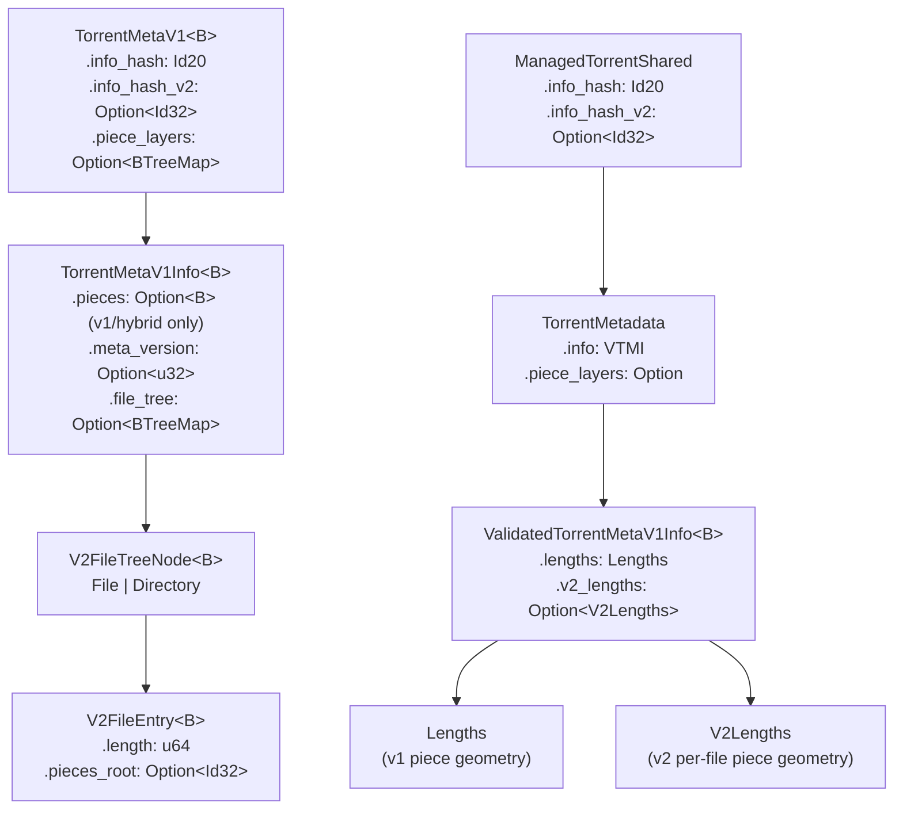

## Appendix C: Reference: libtorrent Design Mapping

| libtorrent (C++) | rqbit (Rust) | Notes |
|---|---|---|
| `info_hash_t { v1, v2 }` | `info_hash: Id20, info_hash_v2: Option<Id32>` | Dual-option instead of struct |
| `hasher` / `hasher256` | `ISha1` / `ISha256` traits | Same strategy pattern |
| `aux::merkle_tree` | `librqbit_core::merkle` | New module in existing crate |
| `file_storage` | `TorrentStorage` trait | Unchanged (storage is version-agnostic) |
| `create_torrent` | `create_torrent_file.rs` | Extended with version option |
| `torrent_info` | `ValidatedTorrentMetaV1Info` + `TorrentMetadata` | Extended with v2_lengths |
| Peer handshake reserved bits | `Handshake.reserved` u64 | Add `set_v2_support()` / `supports_v2()` |
| `hash_request` / `hash_hashes` | `HashRequest` / `HashHashes` | New standard peer wire messages (IDs 21/23), NOT BEP 10 extended |
